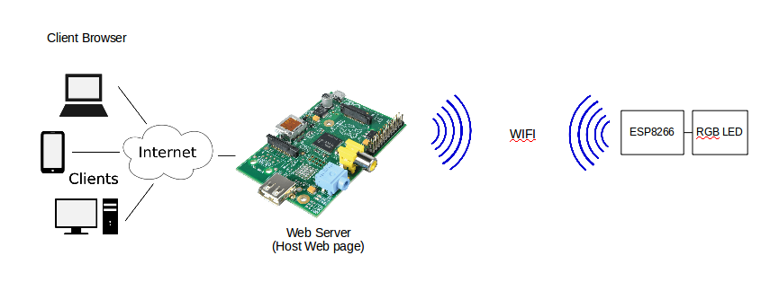
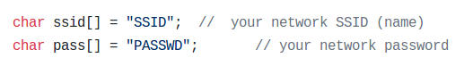
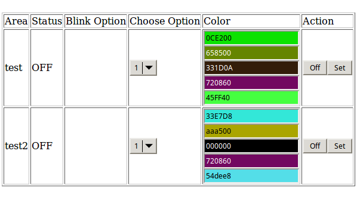
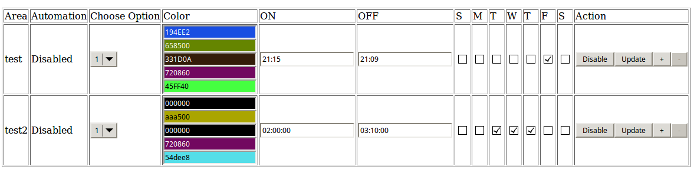

# PI_ESP8266_RGB_LED
Control RGB Led via webpage using Raspberry Pi and ESP8266

 

#### Parts
Raspberry Pi Model B, ESP8266, RGB Led, USB-TTL UART Programmer

## Instruction

### Raspberry Pi 
1. Install the required library
   - apache2,apache2-utils,php5, mysql-server  
  
2. Copy the files from web to /var/www/html/
  
3. Store my_sql.db database to current machine
   - *mysql -u root -p my_db <my_db.sql*

4. Create user and grant privilege
   - *mysql -u username -p my_db*
   - *create user username@'ip_address' identified by 'password';*
   - *grant all privileges on my_db.* to username@ip_address identified by 'password';*
   - *flush privileges;*

5. Update my_db.sql with correct IP address corresponding to area/led id

6. Update the *user* and *pwd* in *automate.sh* as created in #4

7. Update the led common collector (cathode/anode) in *automate.sh* and *index_rgb.php*

8. Using browser,enter the IP address of the Pi hosting the webpage 
    *make sure the Pi IP address is  included in router port forwarding if accessing the page from external network (not local network)
   
* For automation, cron is used. For viewing the cronlist
    *crontab -u www-data -l*

### ESP8266
1. Update the SSID and PASSWD in *esp8266_rgb_led_multi.ino*
	
	
2.  Upload the *esp8266_rgb_led_multi.ino* using Arduino IDE and UART Programmer. 
	 Make sure to select correct Board type in Arduino IDE
	

3. After uploading the program,connect the LED pin as below: 

|  ESP8266 | RGB |
| ------------- | ------------- |
| GPIO0  |  Red  |
| GPIO1(TX)  |   |
| GPIO2  | Green  |
| GPIO3 (RX) | Blue  |

* use resistor when connect to LED pin

## Webpage View

RGB LED:

RGB LED Automation:

